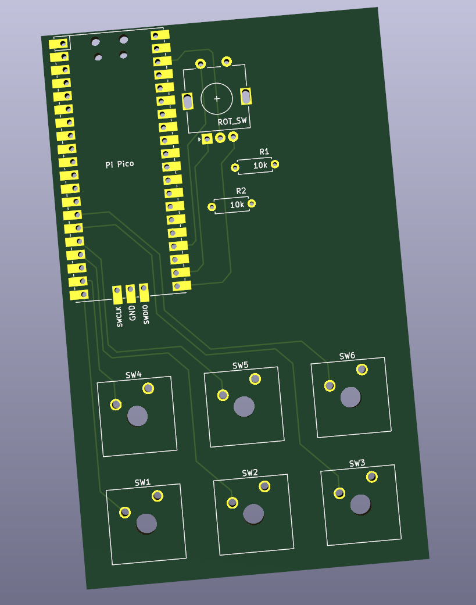
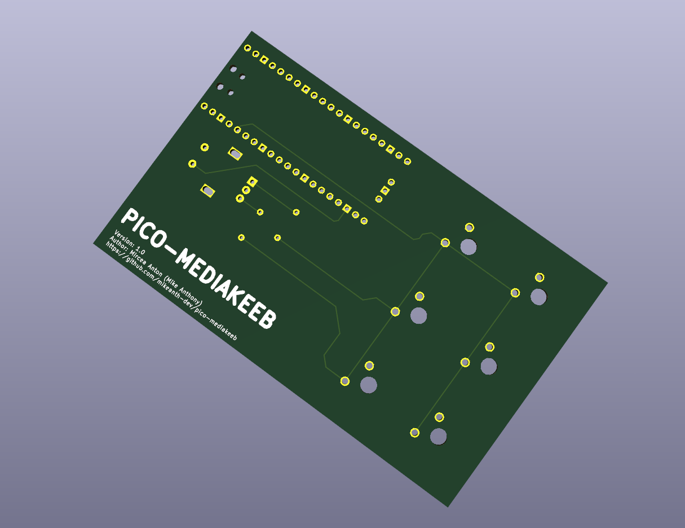

# pico-mediakeeb

A small multimedia macro-pad implemented on top of the RP2040 based Raspberry pi Pico.

---

## Getting Started

The basic steps to get this up and running are:

- Set up your Raspberry Pi Pico
- Order the PCB from your PCB printing service of choice
- Solder all the components to the PCB
- 3D print a case
- Assemble it all together

### Setting up your Pi

Setting up the Raspberry Pi Pico to function as the brains of this operation is a realtively simple 2-step task.

First things first. We need to flash our Pi with the latest CircuitPython uf2 file so that we can use micropython to program it and gain access to useful adafruit libraries.

You can find the latest CircuitPython.uf2 file as well as a flashing guide [here](https://learn.adafruit.com/getting-started-with-raspberry-pi-pico-circuitpython/circuitpython)

Once you flashed your pico, it should unmount by itself and then remount as a storage device called `CIRCUITPYTHON`. That means you succesfully flashed your pi and are ready to continue.  

Next, we need to download or clone this repo, and copy over the contents of `src/` into the mounted `CIRCUITPYTHON` volume, so thy pi can run it. Once you copied everything over, the pi should start running the code. You can tell whether or not it is working by the onboard LED. Once the program starts running, it should turn on. If it doesn't, try unplugging and replugging your pico.

### Printing your own PCB

In the `pcb/` directory of this repo, you can find a KiCAD project that contains the circuit schematic (in case you want to handwire everything) and a PCB design (in case you want to print your own board). You should open the project and generate the gerber files, or just take the pre-generated ones from `pcb/gerber` and send them to your preffered PCB printing service. I personally used JLC PCB.

### Soldering the components to the PCB

The components you need for this project are the following:

- A raspberry pi Pico
- 2 10k ohm resistors
- a rotary encoder with a switch
- 6 cherry-style keyswitches

All the part names are printed onto the PCB, so you should have no issues in finding out what to solder where.

### 3D printing a case

TODO ...

### Assemble it all together

TODO ...
